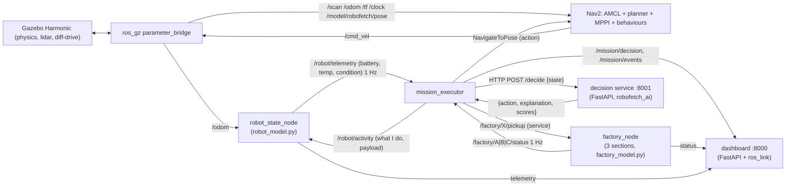

# 01 — Big picture and architecture

## 1. The problem the thesis solves

Thesis title (from `HANDOVER.md`): **"Towards Autonomous Industrial Mobility: An AI Framework for Optimal Path Planning and Resource-Efficient Navigation."**

Here is the setting in plain words.

- A factory hall is **14.5 m × 10 m**, laid out like a maze with walls, racks, a central block and dead ends.
- There are **three production sections**:
  - **A** (north-west) makes 20 units/hour, each 0.5 kg, and its buffer holds 8.
  - **B** (north-east) makes 30 units/hour, each 0.4 kg, and its buffer holds 10.
  - **C** (south-east) makes 5 units/hour, each 1.5 kg, and its buffer holds 3.
- There is **one delivery point** (south-centre) where parts must end up.
- There is **one charger** (south-west). The robot spawns there.
- One **small mobile robot** (4.3 kg, 0.35 × 0.22 m, 2D lidar, 22 Wh battery, 5 kg payload) does all the transport.

The robot is **fully autonomous**. No human gives orders. There is a web page, but it is **read-only**. The only human intervention is stopping the whole system from the console.

The core difficulty is a **sequential decision problem under uncertainty and resource limits**:

1. **Lines stop if you are late.** A full buffer blocks its machine, and every second blocked is lost production.
2. **Energy is limited.** The battery drains while driving, carrying and even standing still (electronics draw 6 W all the time). Charging takes almost an hour from reserve to full.
3. **Time spent on one thing is time not spent on another.** Charging to 100 % can take 50 minutes, and meanwhile all three lines may block.
4. **The factory is random.** Cycle times vary, and machines break down at random times for random durations.
5. **Safety constraints.** The robot must never be unable to get back to the charger with a 15 % reserve, must not overheat its motors, and must not carry more than 5 kg.

The thesis question: **which decision-making method handles this best?** The candidates are hand-written rules, deep RL (PPO), or a neuro-symbolic hybrid, where symbolic rules guarantee safety and priorities and a neural network supplies judgement.

---

## 2. The two layers of autonomy

Robotics work usually separates *what to do* from *how to move*. This project does the same:

```
┌────────────────────────────────────────────────────────────────────────────┐
│  DECISION LAYER  (task-level, every ~1 minute)                             │
│  "What next?"  PICKUP:A | PICKUP:B | PICKUP:C | DELIVER | CHARGE:% | WAIT  │
│  → rule-based  / neuro-symbolic / PPO / fallback                           │
│  lives in: robofetch_ai (models, service) + robofetch_core (executor)      │
└───────────────────────────────┬────────────────────────────────────────────┘
                                │ one action = a destination + what to do there
┌───────────────────────────────▼────────────────────────────────────────────┐
│  MOTION LAYER  (continuous, 10 Hz control)                                 │
│  "How do I get to B without hitting anything?"                             │
│  → Nav2: AMCL localisation, global planner, MPPI controller, recoveries    │
│  lives in: robofetch_nav (config) + Nav2 itself + Gazebo physics           │
└────────────────────────────────────────────────────────────────────────────┘
```

**Why split it?** A decision like "go to B" happens about once a minute and needs knowledge of the factory state. Steering happens 10 times a second and needs lidar and a map. Mixing the two in one RL agent would make learning practically impossible, because an episode would be tens of thousands of wheel commands instead of about 60 decisions. The docstring of `factory_env.py` says it directly: *"the decision problem is 'what next', not 'which wheel speed'. Nav2 and the physics remain the robot's job."*

The thesis title mentions *path planning*. That lives in the motion layer (Nav2 planners, compared in WP8, see file 04) and in the **path matrix** (file 03), which the decision layer uses as its travel-cost model.

---

## 3. The workspace: 10 ROS 2 packages plus tools

```
robofetch_ws/
├── src/
│   ├── robofetch_interfaces   (ament_cmake)   custom message/service types
│   ├── robofetch_description  (ament_cmake)   robot URDF/xacro, robot_state_publisher launch
│   ├── robofetch_gazebo       (ament_cmake)   world SDF, sim launch, ros_gz bridge config
│   ├── robofetch_nav          (ament_cmake)   Nav2 params, occupancy map, navigation launch
│   ├── robofetch_factory      (ament_python)  params.yaml, scenarios, layout, production model, factory node
│   ├── robofetch_core         (ament_python)  robot model, action vocabulary, mission executor, fallback
│   ├── robofetch_ai           (ament_python)  fast simulator, Gym env, policies, trained models, decision service
│   ├── robofetch_bridge       (ament_python)  read-only dashboard backend (FastAPI + ROS listener)
│   ├── robofetch_web          (ament_cmake)   dashboard HTML template + CSS
│   └── robofetch_bringup      (ament_cmake)   mission.launch.py: starts everything
├── scripts/      generate_world.py, param_report.py, check_nav.py, run.sh, stop.sh, ... (file 15)
├── tools/ai/     train_ns.py, train_ppo.py, evaluate.py, validate_against_gazebo.py
├── tools/nav/    compare_planners.py (WP8, uncommitted)
├── logs/         every run's CSV/YAML logs (git-ignored)
├── venv/         Python virtual env with torch, SB3, FastAPI (git-ignored)
├── HANDOVER.md   the work log: every WP, decisions, problems, measured results
└── requirements.txt
```

### 3.1 What each package does

| Package | Key files | Runs as | Depends on ROS? |
|---|---|---|---|
| `robofetch_interfaces` | `msg/SectionStatus.msg`, `msg/TaskEvent.msg`, `srv/Pickup.srv` | generated C++/Python types | yes (it *is* ROS) |
| `robofetch_description` | `urdf/robofetch.urdf.xacro`, `urdf/robofetch.gazebo.xacro`, `launch/rsp.launch.py` | `robot_state_publisher` | yes |
| `robofetch_gazebo` | `worlds/factory_maze.sdf` (generated), `config/bridge.yaml`, `launch/sim.launch.py` | `gz sim`, `parameter_bridge`, `create` | yes |
| `robofetch_nav` | `config/nav2_params.yaml`, `maps/factory_maze.pgm/.yaml` (generated), `launch/navigation.launch.py` | the Nav2 servers | yes |
| `robofetch_factory` | `config/params.yaml`, `config/scenarios/*.yaml`, `config/layout.yaml`, `factory_model.py`, `layout.py`, `factory_node.py`, `monitor.py` | `factory_node`, `factory_monitor`, `poi` | **model files: no**; nodes: yes |
| `robofetch_core` | `robot_model.py`, `mission_plan.py`, `fallback_policy.py`, `mission_executor.py`, `robot_state_node.py` | `mission_executor`, `robot_state_node` | **model files: no**; nodes: yes |
| `robofetch_ai` | `env/factory_sim.py`, `env/factory_env.py`, `env/live_state.py`, `policies/*.py`, `models/ns_scorer.pt`, `models/ppo_policy.zip`, `service.py` | `uvicorn robofetch_ai.service:app` on port 8001 | **no** (deliberately) |
| `robofetch_bridge` | `app.py`, `ros_link.py` | `uvicorn robofetch_bridge.app:app` on port 8000 | yes (listens only) |
| `robofetch_web` | `web/templates/dashboard.html`, `web/static/style.css` | served by the bridge | no |
| `robofetch_bringup` | `launch/mission.launch.py` | `ros2 launch` | yes |

### 3.2 The most important design principle: *one model, used everywhere*

The pure-Python models are written **without any ROS import**:

- `robofetch_core/robot_model.py` for battery, energy, heat and wear,
- `robofetch_core/mission_plan.py` for the actions and their predicted cost,
- `robofetch_factory/factory_model.py` for production,
- `robofetch_factory/layout.py` for POIs and the path matrix.

The **same file** is imported by:

| Consumer | Where it runs |
|---|---|
| `robot_state_node` / `factory_node` | live ROS system alongside Gazebo |
| `mission_executor` (`predict()`) | live ROS system |
| `FactorySim` | fast simulator for training/evaluation (no ROS, no Gazebo) |
| `SymbolicLayer`, `features.py` | inside the AI model's reasoning |
| `param_report.py` | offline analysis of a parameter set |

**Why this matters for the AI:** a model trained in the fast simulator is only useful on the robot if the simulator behaves like the robot. Sharing the model code removes a whole class of "sim-to-real gap" bugs, because an energy value means exactly the same thing in training, in the safety rules and on the live robot. The remaining gap (Nav2 driving vs `distance / speed`) was measured in WP4 at **0.6 % total error** on a 7-action Gazebo mission (`validate_against_gazebo.py`, file 08).

A second principle is **all numbers in one config file**. Every tunable number is in `robofetch_factory/config/params.yaml`, and scenarios override subsets. The loader rejects unknown keys, so a typo fails loudly (file 15).

---

## 4. Data flow of the live system



Topic by topic:

| Topic / service / action | Type | Publisher → Subscriber | Rate |
|---|---|---|---|
| `/clock` | `rosgraph_msgs/Clock` | Gazebo (via bridge) → every node with `use_sim_time` | 250 Hz (4 ms physics step) |
| `/scan` | `sensor_msgs/LaserScan` | Gazebo lidar → AMCL, costmaps | 10 Hz, 360 beams |
| `/odom` | `nav_msgs/Odometry` | Gazebo DiffDrive → Nav2, `robot_state_node` | 30 Hz |
| `/tf` | `tf2_msgs/TFMessage` | Gazebo (odom→base_footprint), robot_state_publisher, AMCL (map→odom) | — |
| `/model/robofetch/pose` | `geometry_msgs/Pose` | Gazebo PosePublisher → executor (ground-truth distance) | 5 Hz |
| `/cmd_vel` | `geometry_msgs/Twist` | Nav2 controller (and executor's brake) → Gazebo | 10 Hz |
| `/amcl_pose` | `PoseWithCovarianceStamped` | AMCL → executor (arrival check), dashboard | on update |
| `/factory/<id>/status` | `robofetch_interfaces/SectionStatus` | `factory_node` → executor, dashboard, monitor | 1 Hz |
| `/factory/<id>/pickup` | `robofetch_interfaces/srv/Pickup` | executor → `factory_node` | per PICKUP |
| `/robot/activity` | `std_msgs/String` (JSON) | executor → `robot_state_node` | on change |
| `/robot/telemetry` | `std_msgs/String` (JSON) | `robot_state_node` → executor, dashboard | 1 Hz |
| `/mission/decision` | `std_msgs/String` (JSON) | executor → dashboard | per decision |
| `/mission/events` | `robofetch_interfaces/TaskEvent` | executor → dashboard | per action start/end |
| `/robot/estop` | `std_msgs/String` | a human with `ros2 topic pub` → executor | manual |
| `navigate_to_pose` | `nav2_msgs/action/NavigateToPose` | executor → bt_navigator | per drive |
| `backup` | `nav2_msgs/action/BackUp` | executor → behavior_server | recovery |
| `/global_costmap/clear_entirely_global_costmap` (+ local) | `nav2_msgs/srv/ClearEntireCostmap` | executor → costmaps | recovery |
| `/lifecycle_manager_navigation/is_active` | `std_srvs/Trigger` | executor → lifecycle manager | at start |
| `POST /decide` (HTTP, not ROS) | JSON | executor → decision service | per decision |

**Why is the AI an HTTP service and not a ROS node?** (`service.py` docstring) *"the AI is unavailable" has to be a state you can produce by stopping a process, so the robot's fallback behaviour is testable rather than theoretical.* It also keeps torch/SB3/FastAPI (in the venv) out of the ROS processes, and lets the AI run on another machine later.

---

## 5. One autonomous run, step by step

The command `./scripts/run.sh scenario:=balanced model:=ns` does the following.

1. **`run.sh`** checks that no simulation is already running (`stop.sh --running`), sources ROS 2 Jazzy, builds with `colcon build --symlink-install`, and runs `ros2 launch robofetch_bringup mission.launch.py scenario:=balanced model:=ns`.
2. **t = 0 s, `mission.launch.py`** includes `navigation.launch.py`, which starts:
   - Gazebo with `factory_maze.sdf`,
   - `robot_state_publisher` with the URDF,
   - the robot spawned at the charger pose from `poi.yaml`,
   - the ros_gz bridge,
   - the whole Nav2 stack, with a temporary params file where AMCL already has the spawn pose as its initial pose,
   - RViz, unless headless.
3. **t = 3 s:** the **decision service** (uvicorn, port 8001) and the **dashboard** (uvicorn, port 8000) start.
4. **t = 5 s:** `factory_node` starts, with sections A/B/C stepping on sim time, and `robot_state_node` starts, integrating battery/heat/wear from `/odom`.
5. **t = 8 s:** `mission_executor` starts. On its worker thread it:
   1. waits until `/lifecycle_manager_navigation/is_active` returns true (Nav2 fully up),
   2. waits for telemetry and for the three pickup services,
   3. publishes the initial pose until AMCL answers on `/amcl_pose`, then waits 3 s of sim time,
   4. enters **autonomous mode**: until `shift_duration_s` of sim time has passed, it builds the state, POSTs `/decide`, executes the answer, and repeats.
6. **Every decision**
   - The executor sends the state JSON:
     ```json
     {"model": "ns", "scenario": "balanced",
      "state": {"time_s": 145.8, "location": "A", "battery_percent": 98.9, "temperature_c": 25.1,
                "condition_percent": 100.0, "payload_kg": 1.3, "cargo_units": 3,
                "shift_duration_s": 3600.0,
                "sections": {"A": {"status": "RUNNING", "buffer_units": 0, ...}, "B": {...}, "C": {...}}}}
     ```
   - The service fills a `LiveState`, computes legal actions, and runs `NeuroSymbolicPolicy.decide()`.
   - It returns, for example, `{"action": "DELIVER", "explanation": "[routine] carrying 3 units; neural score +11.78, chosen over PICKUP:B by +0.30", "scores": {...}, "latency_ms": 5.2}`.
   - The executor publishes this on `/mission/decision`, and the dashboard shows it.
7. **Every action** (`run_action`)
   1. `predict()` computes the expected distance/time/energy from the robot model and the path matrix.
   2. A `STARTED` TaskEvent is published.
   3. **Driving:** NavigateToPose goes to the POI with a timeout. On success, the AMCL pose is checked against the POI (≤ 0.35 m). On failure, the recovery ladder runs: clear costmaps, then back up, then give up and go to the charger.
   4. **At the POI:** PICKUP sleeps 30 s of sim time and then calls `/factory/X/pickup` with the remaining payload capacity. DELIVER sleeps 30 s and empties the cargo. CHARGE sets activity "charging" and waits until telemetry shows the target battery. WAIT sleeps.
   5. A `SUCCEEDED`/`FAILED` TaskEvent is published with measured vs predicted values, and a CSV row is written.
8. **Service down?** If the HTTP call throws (connection refused, timeout, error JSON), the executor calls `fallback_policy.decide()` and marks the decision `fallback: true`.
9. **Shift over:** `logs/<run_id>_mission_summary.yaml` is written. It holds actions, distance, energy, delivered units per section, decision stats (asked, answered by model, fallback, mean latency), navigation stats, and prediction error.
10. The system **keeps running** until the operator runs `./scripts/stop.sh`. By design, nothing stops automatically.

A real result from `HANDOVER.md` (WP7): a 900 s balanced shift with `model:=ns` gave 17/17 actions succeeded, 17 decisions by the model with 0 fallbacks, 13 units delivered, 170 m driven, 2.5 Wh used, and prediction error of −0.5 % duration, −0.1 % distance, −0.2 % energy.

---

## 6. The offline AI pipeline

```
params.yaml + scenarios + path_matrix.yaml
          │
          ▼
   FactorySim (fast simulator, ~0.07 s per 1-hour shift with the rule policy)
          │
   ┌──────┼───────────────────────────────┬───────────────────────────┐
   ▼      ▼                               ▼                           ▼
train_ns.py                          train_ppo.py                 evaluate.py
(rollout-labelled ranking data       (FactoryEnv Gymnasium,       (policies × scenarios × seeds,
 → ActionScorer MLP)                  MaskablePPO)                  bootstrap CI, CSV)
   │                                      │
   ▼                                      ▼
models/ns_scorer.pt                  models/ppo_policy.zip
   │                                      │
   └──────────────┬───────────────────────┘
                  ▼
     service.py (live) ← the exact same policy objects
                  │
                  ▼
     validate_against_gazebo.py: replay a real Gazebo mission in FactorySim, check ≤ 15 % error
```

---

## 7. Work packages (from HANDOVER.md), so you know what was built when

| WP | Date | Result |
|---|---|---|
| WP0 | 2026-09-15 | Clean repo, venv (numpy < 2, setuptools < 80, CPU torch) |
| WP1 | 2026-09-15 | Maze from ASCII grid, generator for world/map/POIs/matrix, pinch detector; 7/7 nav tour, planner vs matrix ≤ 2.0 % |
| WP2 | 2026-09-15 | Production model (Gamma, blocking, wear, faults), SectionStatus/Pickup interfaces; later all numbers moved to `params.yaml` with realistic values |
| WP3 | 2026-09-15 | Action vocabulary, `predict()`, mission executor, emergency stop; prediction error ≤ 2.1 % |
| WP3b | 2026-09-16 | Drive timeout, arrival verification, recovery ladder, `navigation_stuck`; manual-stop policy for scripts |
| WP4 | 2026-09-16 | Fast simulator, Gymnasium env, Policy interface, rule-based reference, evaluation tool, Gazebo validation (0.6 %) |
| WP5/6 | 2026-09-16 | Neuro-symbolic model, rollout training with ranking loss, PPO comparison, ablations |
| WP7 | 2026-09-16 | Decision service, LiveState, autonomous executor with fallback, read-only dashboard |
| Scenarios | 2026-09-16 | 6 more scenarios (12 total), interactive `run.sh`, `fallback` mode, dashboard in launch |
| WP8 | paused | Global planner comparison (5 planners); phase 1 complete, driving repeats incomplete, **uncommitted** |
| WP9 | not started | (Plan mentions robustness tests such as moving obstacles) |

---

## 8. Key concepts of this section

- **Hierarchical autonomy.** Separating task-level decisions (seconds to minutes, symbolic) from motion control (milliseconds, geometric). It is the same idea as *options* in hierarchical RL and task/motion planning (TAMP) in robotics.
- **Single source of truth.** One file defines each thing: `layout.yaml` for geometry, `params.yaml` for numbers, `robot_model.py` for physics. Everything else is generated from it or imports it.
- **Digital twin / surrogate simulator.** `FactorySim` is a cheap surrogate of the Gazebo+Nav2 system, validated against it.
- **Process isolation for fault tolerance.** The AI runs in its own process, and the fallback lives in the package that cannot fail with it.
- **Observability.** Every action logs predicted vs measured values, and every decision logs its explanation and latency.

---

## 9. Improvements and technologies for this section (architecture level)

| Idea | Why | How |
|---|---|---|
| **Replace JSON-in-`std_msgs/String`** (`/robot/telemetry`, `/robot/activity`, `/mission/decision`) with typed messages | JSON strings have no schema. A renamed key silently breaks the executor or dashboard, and `ros2 bag` cannot introspect them | Add `RobotTelemetry.msg`, `RobotActivity.msg`, `Decision.msg` to `robofetch_interfaces`, publish typed fields |
| **Record runs with `ros2 bag` (MCAP)** | CSV logs capture only what the code chose to log. A bag replays the full run (scan, tf, decisions) for debugging and figures | `ros2 bag record -s mcap /factory/... /robot/telemetry /mission/... /amcl_pose /tf` as a launch option |
| **ROS 2 action server for the decision layer** instead of HTTP | Removes the hand-rolled HTTP client, gives feedback/cancel semantics, is visible in `ros2 action list` | Only if you drop the "kill a process to test fallback" argument. A ROS node can be killed too. The trade-off is venv vs system Python. |
| **Containerise** (Docker/`rocker`) | The venv + `--system-site-packages` + numpy<2 + setuptools<80 setup is fragile | One image with ROS Jazzy + Gazebo Harmonic + pinned pip deps; `docker compose` for sim + AI service |
| **Continuous integration** | 161 tests exist but nothing runs them automatically | GitHub Actions with the `ros:jazzy` image: `colcon build`, `pytest`, `evaluate.py --seeds 2` as a smoke test |
| **Behaviour-tree task layer** (BehaviorTree.CPP / `py_trees`) | The executor's recovery ladder and action phases are hand-written sequential code. A BT makes them visual, reusable and testable | Model PICKUP as a BT subtree: `NavigateToPose → VerifyArrival → Dwell → CallPickup` with `RecoveryNode` retries |
| **Fleet management layer** (Open-RMF) | The thesis is single-robot. Real factories run fleets with traffic negotiation | Future work: Open-RMF fleet adapter around the executor; tasks = RMF delivery tasks |
